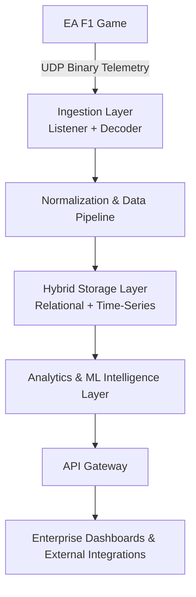

# 🏎️ APX IQ — Real-Time Formula 1 Intelligence Platform

APX IQ is a real-time motorsport intelligence platform that ingests live telemetry from the EA Sports F1 game via UDP, processes it through a structured data pipeline, stores it in hybrid databases, and delivers analytics and AI-driven insights through enterprise-grade dashboards and APIs.

## 🚀 Vision

APX IQ is designed as a product platform, not a one-off project.

It simulates the data and intelligence stack of a professional Formula 1 team, combining:

*   Real-time telemetry ingestion
*   Scalable database architecture
*   Advanced analytics
*   Machine learning intelligence
*   Enterprise UI dashboards

The goal is to bridge raw motorsport telemetry with actionable intelligence.

## 🧠 Core Capabilities

### 1) Real-Time Telemetry Ingestion
*   UDP-based ingestion from EA Sports F1 game
*   Official EA UDP specification compliance
*   Binary packet decoding and normalization
*   Session-aware data processing

### 2) Hybrid Data Architecture
*   Relational database for core entities
*   Time-series storage for high-frequency telemetry
*   Analytics and derived metrics layer

### 3) Intelligence & Analytics
*   Driver performance analytics
*   Lap and sector performance metrics
*   Strategy insights (pit windows, tire degradation)
*   Anomaly detection and behavioral profiling

### 4) Machine Learning Layer
*   Lap time prediction models
*   Driver style clustering
*   Strategy optimization simulations
*   Performance forecasting

### 5) API-Driven Platform
*   Versioned REST APIs
*   Structured telemetry and analytics endpoints
*   Extensible integration layer

### 6) Enterprise-Grade UI
*   Role-based dashboards (Strategist, Engineer, System)
*   Real-time telemetry visualization
*   Comparative analytics and KPIs
*   Progressive UI layers (basic → enterprise)

## 🏗️ System Architecture (High-Level)



## 🗂️ Repository Structure

```text
apx-iq-platform/
│
├── docs/        # Architecture, specifications, diagrams
├── ingestion/   # UDP listener, packet decoding, routing
├── core/        # Normalization, session context, pipelines
├── db/          # Database schema, migrations, seeds
├── api/         # REST API services
├── analytics/   # Metrics and intelligence logic
├── ml/          # Machine learning pipelines and models
├── ui/          # Frontend dashboards (basic + enterprise)
├── infra/       # Docker, configs, environment setup
├── scripts/     # Utilities and tools
├── tests/       # Unit and integration tests
└── README.md
```

## 🧩 Design Principles

APX IQ follows strict engineering principles:

*   **Backend-first architecture**
*   **Stable core schema** (no breaking changes after freeze)
*   **Append-only telemetry data**
*   **Layered modular design**
*   **Versioned API contracts**
*   **Progressive feature gating**
*   **Local-first development**, cloud burst compute
*   **Explainability in DBMS terms**

## 🔐 Development Philosophy

APX IQ is built like a real product:

*   The backend is designed to be stable from early stages.
*   The frontend evolves progressively.
*   Advanced features are gated and revealed in phases.
*   Architecture decisions prioritize scalability and maintainability.

This repository is structured to support long-term evolution into a public platform.

## 🛠️ Technology Stack (Indicative)

### Backend & Data
*   **Python / Node.js** (ingestion & services)
*   **PostgreSQL / MySQL** (relational DB)
*   **Time-series storage** (TimescaleDB / InfluxDB)
*   **Docker** (containerization)

### Analytics & ML
*   **NumPy, Pandas, Scikit-learn**
*   **Custom simulation and strategy engines**

### Frontend
*   **React / Next.js** (dashboards)
*   **Charting & visualization libraries**

### Infrastructure
*   **Local + Cloud** (AWS/GCP burst compute)
*   **REST APIs**

## 📈 Roadmap

### Phase 1 — Core Infrastructure
*   UDP ingestion pipeline
*   Database schema
*   Core APIs

### Phase 2 — Analytics Layer
*   Derived metrics
*   Basic dashboards

### Phase 3 — Intelligence Layer
*   Machine learning models
*   Strategy analytics
*   Enterprise UI

### Phase 4 — Platform Evolution
*   Performance optimization
*   Public deployment readiness
*   Extended analytics and integrations

## ⚠️ Disclaimer

APX IQ is a research and engineering platform built for experimentation, learning, and system design exploration.

It is not affiliated with Formula 1, EA Sports, or Codemasters.

All telemetry data is sourced from the EA Sports F1 game via officially documented UDP interfaces.

## 🧠 Identity Statement

**APX IQ is not a typical software project.**
It is a real-time motorsport intelligence platform designed with enterprise architecture and product-first engineering principles.
