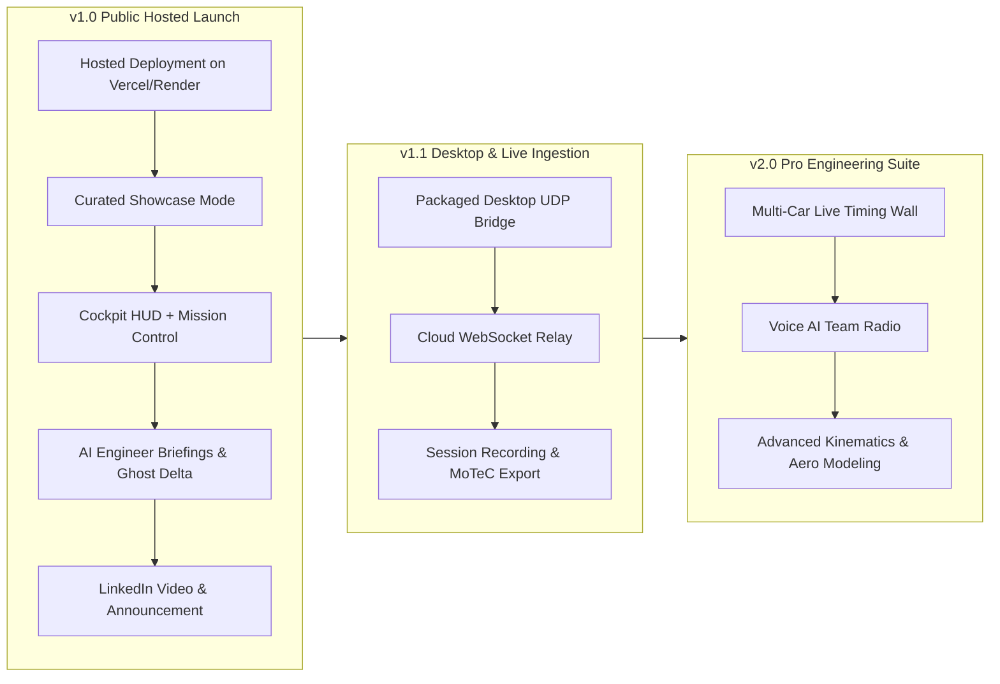

# APX-IQ — Product Launch Roadmap & Version Milestones

**Target Launch**: v1.0 Public Release & LinkedIn Announcement  
**Project**: APX-IQ Motorsport Intelligence Platform  
**Owner**: Mridul  
**Status**: ACTIVE BLUEPRINT  

---

## 1. The Core Objective & Problem Statement

### Why we need this roadmap:
Until now, development progressed rapidly through foundational milestones (multi-version UDP packet decoders, adapters, zero-fabrication honest UI, state management, test suites). However, without clear version boundaries and a defined "Definition of Done" for public launch, work naturally drifted into open-ended additions rather than shipping a polished, standalone product.

### The v1.0 Goal:
**Ship a hosted, high-performance web workstation that any LinkedIn viewer, hiring manager, or motorsport enthusiast can open in their browser, immediately experience interactive F1 telemetry analysis and live cockpit simulation, and understand the technical depth of the architecture.**

---

## 2. Target Persona & Experience for Hosted Launch

When someone clicks the link from LinkedIn:
1. **The Hiring Manager / F1 Engineer (Evaluation)**:
   - Looks at architecture, code cleanliness, protocol completeness, and data fidelity.
   - Evaluates the dual telemetry comparison (User vs. FastF1 Benchmark / Ghost), G-G friction circle, delta-time math ($\Delta t$), and AI Race Engineer briefings.
2. **The Sim Racer / Driver (Utility)**:
   - Wants to see if it supports their game (F1 2020–2025), how easy it is to connect, and the depth of telemetry channels (tyre wear, temps, setup matrix, brake bias).
3. **The General Tech / AI Audience (Aesthetics & Delight)**:
   - Mesmerized by the high-density aesthetic (McLaren Applied ATLAS / MoTeC i2 inspired dark UI), fluid 60fps telemetry ribbon, live shift lights, and clean visual hierarchy.

---

## 3. Version Roadmap & Milestones

---

## 4. Milestone Breakdown for v1.0 Launch

### Milestone 1: Production Polish & Hosted Readiness (Days 1–2)
*Ensure the web app runs flawlessly on a public URL (e.g., Vercel / Railway / Cloud Run).*

- [ ] **1.1 Zero-Setup Hosted Mode ("Showcase / Demo")**:
  - Automatically loads a high-fidelity reference session (e.g., Silverstone / Spa / Monza) when accessed publicly without an active UDP connection.
  - Interactive scrubbing: user can drag the timeline, click sectors, and switch drivers (e.g. Verstappen vs Hamilton vs Leclerc).
  - Clear visual indicator: `DEMO REPLAY (FastF1 Official FIA Timing)` with option to switch to `WAITING FOR UDP STREAM (Port 20777)`.
- [ ] **1.2 Clean Route Architecture**:
  - `/`: High-impact landing & operational gateway with live interactive preview.
  - `/dashboard`: High-frequency Cockpit HUD (Gauges, 4-corner thermals, shift lights, track map).
  - `/dashboard/intelligence`: Mission Control analysis (Multi-channel strip chart, continuous $\Delta t$ delta ribbon, corner $V_{min}$ breakdown, setup matrix).
- [ ] **1.3 Responsive & Performance Audit**:
  - Verified across desktop displays (1080p, 1440p, Ultrawide, MacBook 14"/16").
  - 60fps steady rendering with 0 console warnings or runtime exceptions.

---

### Milestone 2: Platform-Wide Edge Cases Preparation & Code Hardening
*Systematically identify, stress-test, and code defensively against all failure modes across frontend, state, networking, and backend.*

- [ ] **2.1 Math & Telemetry Channel Safeguards (NaN / Zero-Division / Range Clamping)**:
  - Guard delta math ($\Delta t = \int (1/v_1 - 1/v_2) dx$) when $v \le 0$ or car is stationary in pits/grid.
  - Guard percentage math when total laps = 0, track length = 0, or ERS energy capacity = 0.
  - Clamp tyre wear %, damage %, brake temperature bounds, and coordinate normalizations to prevent graphical clipping or canvas errors.
- [ ] **2.2 Connection & Network Fault Tolerance**:
  - Zero-latency graceful degradation when WebSocket disconnects or backend is unreachable (no crashing, no unhandled promise rejections, clear offline state).
  - Clean socket lifecycle handling: proper teardown on unmount and page navigation, preventing listener accumulation or memory leaks.
  - Automatic reconnection backoff with jitter.
- [ ] **2.3 Multi-Device & Mobile Viewport Defensive Layout**:
  - Prevent canvas overflow or illegible layout smashing on mobile / small screens.
  - Add responsive modal / notification on screens $< 1024px$ indicating optimal experience is desktop/tablet widescreen workstation.
- [ ] **2.4 Missing / Corrupt Packet & Legacy Game Version Handling**:
  - Cross-version fallback: missing fields in older game versions (F1 2020 vs 2025) cleanly render as `NoSignal` / `N/A` rather than throwing errors.
  - Graceful handling of out-of-order UDP packets, session restarts, flashbacks (`FLBK`), and spectator/unfitted car indices.
- [ ] **2.5 API & AI Intelligence Resiliency**:
  - Handle missing Gemini API key or rate limits with pre-generated fallback engineering briefings.
  - FastF1 offline fallback: serve static pre-bundled telemetry when external FIA data cannot be fetched live.

---

### Milestone 3: Cloud Backend & API Deployment
*Host the lightweight Python API & intelligence service.*

- [ ] **3.1 FastF1 & Intelligence API Service**:
  - Deploy FastAPI backend to Railway / Render / Fly.io / Cloud Run.
  - Pre-cached reference session datasets (Silverstone, Bahrain, Monza, Spa, Interlagos) for instant, zero-latency loading.
- [ ] **3.2 Frontend-to-Backend Cloud Connection**:
  - Secure HTTPS / WSS endpoints configured via environment variables (`NEXT_PUBLIC_API_URL`).
  - Seamless offline fallback: if backend is sleeping or spinning up, frontend gracefully serves pre-bundled static JSON reference laps.

---

### Milestone 4: Packaging & Documentation for Public Eyes
*Make the GitHub repo star-worthy and ready for technical inspection.*

- [ ] **4.1 High-Impact README.md**:
  - Eye-catching banner & animated demo GIF / video badge.
  - High-level architecture diagram (UDP $\to$ C-types Parser $\to$ Universal Adapter $\to$ WebSocket $\to$ Next.js 15).
  - Protocol completeness matrix badge (F1 2020–2025 supported).
  - 1-command quickstart guide for sim racers (`pip install -r requirements.txt` / `python ingestion/main.py`).
- [ ] **4.2 Live Demo Link**:
  - Add prominent `[Live Demo]` badge in header.

---

### Milestone 5: LinkedIn Announcement Strategy & Media Kit

- [ ] **5.1 Announcement Copy (The Narrative)**:
  - **Hook**: Why I built an elite Formula 1 telemetry platform from scratch (bridging the gap between raw sim racing data and Tier-1 race engineering tools like McLaren ATLAS & MoTeC).
  - **Technical Highlights**:
    - Multi-version binary packet decoder across 6 F1 game generations.
    - Zero-fabrication honest UI architecture (no fake data, pure transmitted telemetry).
    - Sub-millisecond continuous $\Delta t$ math channel against official FIA FastF1 reference laps.
    - Full-stack performance (Python C-types, FastAPI, Next.js 15, Canvas 2D RAF scheduler, Zustand).
  - **Call to Action**: Try the live web app, check out the open-source repo, feedback welcome from race engineers and sim racers.
- [ ] **5.2 Visual Media (Video / Carousel)**:
  - 45–60s crisp, high-bitrate screen recording showing:
    1. Cockpit HUD in action (shift lights, tyre thermals, track map sync).
    2. Mission Control telemetry scrubbing (instant delta time updates, sector zoom).
    3. AI Engineer briefing generation.
    4. Setup matrix inspection.

---

## 5. Definition of Done for v1.0 Launch

| Criteria | Target |
| :--- | :--- |
| **Hosted URL** | Live and publicly accessible with 99.9% uptime on HTTPS |
| **Zero-Config Experience** | Instant interactive showcase loads within <1.5s on first visit |
| **Type Safety & Tests** | `tsc --noEmit` = 0 errors; `pytest` = 100% pass |
| **Visual Quality** | Dark motorsport theme, zero broken images/layouts, 60fps animations |
| **GitHub Repo** | Polished README, architecture diagrams, verified documentation |
| **Launch Post** | Structured LinkedIn post with high-resolution demo clip and live links |

---

## 6. Post-v1.0 Milestone Preview

- **v1.1**: Standalone Electron / PyInstaller executable desktop tray app for 1-click UDP streaming to cloud.
- **v1.2**: MoTeC `.ld` export engine and CSV telemetry downloader.
- **v2.0**: Web Audio AI Race Engineer voice radio & real-time cornering coaching cues.
