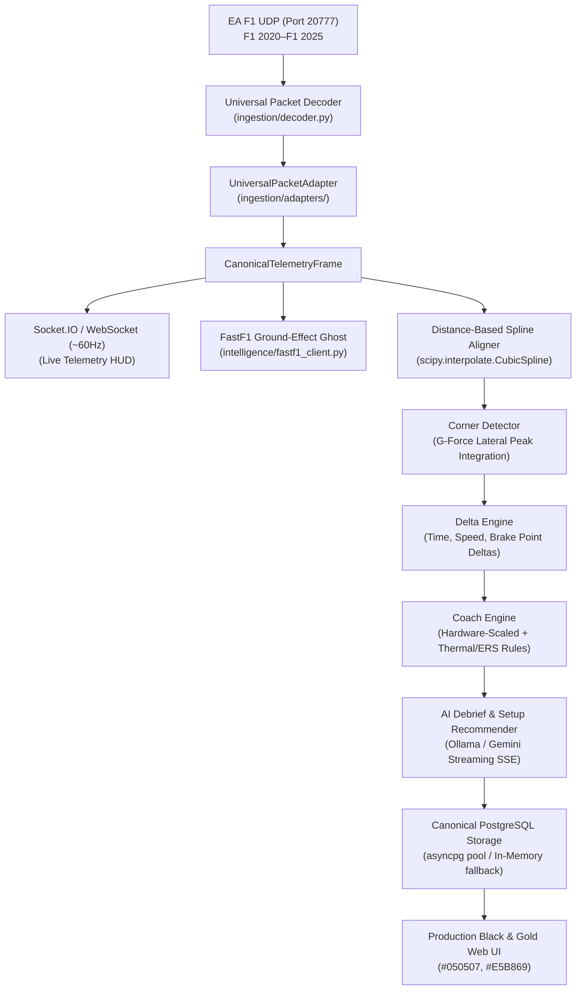

# APX-IQ Platform — Master System Design Document (SDD)

> **Document Version:** 2.0.0  
> **Status:** Production Architecture & Master Reference  
> **Target Audience:** Engineering, Sim Racing Drivers, Platform Architects  

---

## 1. Executive Summary

**APX-IQ** is a low-latency, AI-augmented telemetry engineering and mid-race coaching platform for modern Formula 1 sim racing. It ingests binary UDP telemetry across all contemporary Formula 1 titles (**F1 2020, F1 2021, F1 22, F1 23, F1 24, and F1 25**), normalizes data into canonical physics frames, aligns laps against real-world FIA telemetry via **FastF1**, computes millisecond-accurate delta metrics, and provides real-time coaching, interactive track ribbon maps, and AI post-lap race debriefs with mechanical car setup advice.



---

## 2. Multi-Version UDP Telemetry Ingestion Layer

### 2.1 Supported Game Protocols & Formats

APX-IQ supports automatic header inspection of byte offset `0..2` (`m_packetFormat` uint16):

| Version | Format ID | Packet Size (Motion) | Lap Data Format | Wheel Temp Array |
|---|---|---|---|---|
| **F1 2020** | `2020` | 1464 bytes | Float32 seconds | 4 $\times$ uint8 surface, 4 $\times$ uint8 inner |
| **F1 2021** | `2021` | 1464 bytes | Uint32 milliseconds | 4 $\times$ uint8 surface, 4 $\times$ uint8 inner |
| **F1 22** | `2022` | 1464 bytes | Uint32 milliseconds | 4 $\times$ uint8 surface, 4 $\times$ uint8 inner |
| **F1 23** | `2023` | 1349 bytes | Uint32 milliseconds | 4 $\times$ uint8 surface, 4 $\times$ uint8 inner |
| **F1 24** | `2024` | 1349 bytes | Uint32 milliseconds | 4 $\times$ uint8 surface, 4 $\times$ uint8 inner |
| **F1 25** | `2025` | 1349 bytes | Split min + ms Uint16 | 4 $\times$ uint8 surface, 4 $\times$ uint8 inner |

### 2.2 Canonical Telemetry Frame

All game versions map into a single immutable dataclass:

```python
class CanonicalTelemetryFrame:
    session_uid: int
    frame_identifier: int
    session_time: float
    lap_number: int
    lap_distance_m: float
    speed_kph: float
    throttle: float              # 0.0 – 1.0
    brake: float                 # 0.0 – 1.0
    steer: float                 # -1.0 – +1.0
    gear: int                    # -1 (R), 0 (N), 1..8
    rpm: int
    drs: bool
    g_force_lat: float
    g_force_lon: float
    tyres_surface_temp: list[int] # [FL, FR, RL, RR] in °C
    tyres_inner_temp: list[int]   # [FL, FR, RL, RR] in °C
    brakes_temp: list[int]        # [FL, FR, RL, RR] in °C
    ers_store_energy: float       # Joules (0 – 4MJ)
    world_pos_x: float
    world_pos_y: float
    world_pos_z: float
```

---

## 3. Mathematical Alignment & Intelligence Pipeline

1. **Distance-Based Normalization**:
   Time-based telemetry cannot directly compare laps of unequal durations. The `DistanceAligner` resamples telemetry onto a uniform spatial grid of $N$ equidistant points ($S \in [0, D_{\text{circuit}}]$) using cubic splines:
   $$\text{Telemetry}(s) = \mathcal{S}_{\text{Cubic}}(s)$$

2. **Corner Identification**:
   Corners are detected by integrating lateral acceleration peaks ($|G_{\text{lat}}| > 1.2\text{G}$) and local minimum speed apexes.

3. **Cumulative Delta Integration**:
   $$\Delta T(s) = \int_{0}^{s} \left( \frac{1}{v_{\text{user}}(\sigma)} - \frac{1}{v_{\text{ghost}}(\sigma)} \right) d\sigma$$

4. **Hardware-Aware Coaching Rules**:
   - Keyboard / Controller / Direct Drive steering threshold scaling.
   - Thermal over-temperature warnings ($> 106^\circ\text{C}$ on rear tyres).
   - Rotor brake glazing ($> 920^\circ\text{C}$) and cold rotor lockup hazards ($< 190^\circ\text{C}$).
   - MGU-K energy battery derating detection ($< 300\text{kJ}$ remaining on straights).

---

## 4. Real-Time Virtual Track Ribbon (Option C)

- **Vector Spline Foundation**: Normalized circuit coordinate reference $(X, Y)$ scaled into an SVG viewport.
- **Dynamic Real-Time Ribbon**: HTML5 Canvas trail color-coded by live pedal application:
  - Full Throttle ($>85\%$): `#E5B869` (Gold)
  - Coasting / Partial: `#E0E0E0` (Off-white)
  - Heavy Braking ($>10\%$): `#FF334B` (Race Red)
  - DRS Deployment: `#00F0FF` (Aerodynamic Cyan)

---

## 5. Security & Persistence Architecture

- **Zero Unauthenticated Deletions**: Destructive endpoints (`/telemetry/laps/clear`, `/intelligence/reports/clear`) require `X-Admin-Key` verification.
- **Concurrent Non-Blocking WebSockets**: `ConnectionManager.broadcast` uses `asyncio.gather` with a 100ms per-socket timeout, isolating slow network clients.
- **Database Abstraction**: `DatabaseLapService` and `DatabaseReportService` interface with PostgreSQL connection pools via `asyncpg`, with seamless fallback to in-memory testing stores.
- **GenAI Token Streaming**: Real-time SSE token stream (`/intelligence/report/lap/stream`) supporting local 20B Ollama and Gemini backends.

---

## 6. UI/UX Black & Gold Design System

- **Background Canvas**: Pure Carbon `#050507`
- **Surface Elevation**: `#0C0C10`
- **Primary Accent**: Championship Gold `#E5B869`
- **Secondary Accent**: Liquid Gold `#D4AF37`
- **Telemetry Red**: `#FF334B`
- **DRS Cyan**: `#00F0FF`
- **Typography**: Inter (UI text) + JetBrains Mono (Telemetry digits)
