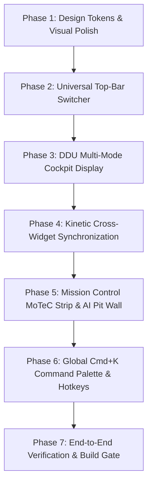

# APX-IQ — High-End UI Elevation & Redesign Task Ledger
**Branch:** `feature/high-end-ui-redesign`  
**Master Spec:** [`docs/architecture/SPEC_HIGH_END_UI_REDESIGN.md`](file:///C:/Mridul/Programs/APXIQ/apx-iq-platform/docs/architecture/SPEC_HIGH_END_UI_REDESIGN.md)  
**Status:** COMPLETED & VERIFIED (READY FOR USER REVIEW)  

---

## 📋 Phased Execution Task Breakdown

---

### 🎨 Phase 1: Design Tokens & Visual Polish
*Eliminate layout shifts, fix text clipping, refine borders, and establish double-bezel materiality.*

- [x] **Task 1.1: Refine `globals.css` Design Tokens & Hover Mechanics**
  - **File:** `ui/src/app/globals.css`
  - **Action:** Removed global `.apx-panel:hover { transform: translateY(-2px); }` that caused cockpit panel layout jumps; replaced with isolated card hover classes.
  - **Action:** Updated `.text-gold` gradient text-clip so it aligns with monospace baseline without flexbox quirks.
  - **Action:** Defined double-bezel utility classes (`.double-bezel-outer`, `.double-bezel-inner`).
- [x] **Task 1.2: Standardize Panel Headers & Micro-Labels**
  - **Files:** `ui/src/components/cockpit/PanelHeader.tsx`, `ui/src/components/cockpit/primitives.tsx`
  - **Action:** Enforced strict mathematical typography: `text-[9px] font-mono uppercase tracking-[0.18em]` for engineering micro-labels; crisp titanium borders (`border-white/[0.08]`).

---

### 🌐 Phase 2: Universal Top-Bar Workstation Switcher
*Enable instant 1-click fluid movement between Cockpit HUD, Mission Control, and System Observability.*

- [x] **Task 2.1: Upgrade `StatusBar.tsx` with Universal Workstation Switcher**
  - **File:** `ui/src/components/cockpit/StatusBar.tsx`
  - **Action:** Added floating pill navigation buttons (`[⊞ COCKPIT HUD]`, `[⚡ MISSION CONTROL]`, `[📟 OBSERVABILITY]`) that highlight the active route.
  - **Action:** Maintained live session clock, weather pills, safety car status, and FIA flag indicators.
  - **Action:** Verified clean responsive rendering across all pages (`/`, `/dashboard`, `/dashboard/intelligence`, `/debug`).

---

### 🏎️ Phase 3: DDU Multi-Mode Cockpit Display
*Transform the central steering cluster into a Cosworth / Bosch Driver Display Unit with 4 switchable modes.*

- [x] **Task 3.1: Implement DDU Mode State & Tab Switcher**
  - **File:** `ui/src/components/cockpit/CentralTelemetry.tsx`
  - **Action:** Added mode tabs on top of the digital display: `[RACE]`, `[QUALY]`, `[TYRES]`, `[CHASSIS]`.
  - **Action:** Supported interactive clicking + keyboard number hotkeys (`1`, `2`, `3`, `4`) to switch modes.
- [x] **Task 3.2: Render Mode-Specific Telemetry Overlays**
  - **`[RACE]`**: Primary gear (center), ground speed, continuous delta bar, ERS battery %, fuel kg.
  - **`[QUALY]`**: Sector 1/2/3 micro-chips, suggested gear cues, DRS readiness pill, rev curve.
  - **`[TYRES]`**: 4-corner PSI inflation, core carcass temperatures, brake fluid thermal headroom.
  - **`[CHASSIS]`**: Suspension damper travel ($mm$), wheel slip ratio %, and G-force load vector.

---

### ⚡ Phase 4: Kinetic Cross-Widget Synchronization
*Unify all cockpit instruments to a single synchronized telemetry playhead.*

- [x] **Task 4.1: Connect Telemetry Ribbon Scrubbing to Circuit Radar & Tyre Pods**
  - **Files:** `ui/src/components/cockpit/TelemetryRibbon.tsx`, `ui/src/components/cockpit/TrackMap.tsx`, `ui/src/components/cockpit/RaceCarTelemetry.tsx`
  - **Action:** When user hovers/scrubs along the distance ribbon, update `cockpitCursor.dist`.
  - **Action:** In `TrackMap.tsx`, smoothly glide the radar car chevron and reticle to that exact meter on circuit.
  - **Action:** In `RaceCarTelemetry.tsx`, dynamically modulate tyre surface/core temps and brake disc incandescent glow to reflect the exact load at that corner.

---

### 📊 Phase 5: Mission Control MoTeC Strip & Consolidated AI Pit Wall
*Upgrade `/dashboard/intelligence` to industry-standard data analysis.*

- [x] **Task 5.1: High-Precision 5-Tier MoTeC Strip Recorder**
  - **File:** `ui/src/components/intelligence/TelemetryDeltaChart.tsx`
  - **Action:** Synchronize multi-channel curves (Speed User vs Ghost, throttle, brake, dynamic apex callouts) with vertical hairline cursor.
- [x] **Task 5.2: Clickable Apex Radar Nodes**
  - **Files:** `ui/src/components/cockpit/TrackMap.tsx`, `ui/src/components/intelligence/SectorApexMatrix.tsx`
  - **Action:** Synchronize turn entry/apex/exit distance positions across telemetry charts.
- [x] **Task 5.3: Consolidated Tactical AI Pit Wall Radio**
  - **Files:** `ui/src/components/intelligence/AiEngineerBriefingBox.tsx`, `ui/src/components/intelligence/TechnicalDebriefViewer.tsx`
  - **Action:** Added real-time audio waveform visualizer, pit radio transcripts, coaching takeaways with measured vs heuristic impact, and one-click JSON/whitepaper report export.

---

### ⌨️ Phase 6: Global Command Palette (`Cmd+K`) & Keyboard Engine
*Mouse-independent power-user navigation.*

- [x] **Task 6.1: Build Global `Cmd+K` Command Palette Dialog**
  - **File:** `ui/src/components/cockpit/CommandPalette.tsx`
  - **Action:** Implemented keyboard-triggered search dialog for Grand Prix tracks, reference drivers, DDU display modes, and session presets.
- [x] **Task 6.2: Global Keyboard Navigation Hook**
  - **File:** `ui/src/hooks/useWorkstationHotkeys.ts`
  - **Action:** Bound `Cmd+K`/`Ctrl+K` (Command Palette), `Shift+1`/`2`/`3` (Workstation view switcher), `1`/`2`/`3`/`4` (DDU modes), `Space` (Play/Pause sweep), `M` (Motion), `D` (Density).

---

### 🛡️ Phase 7: Verification & Build Gate
*Verify zero regressions, strict type safety, and production build.*

- [x] **Task 7.1: TypeScript Strict Check (`npx tsc --noEmit`)** $\rightarrow$ **0 errors (100% type safe)**.
- [x] **Task 7.2: Next.js Production Build (`npm run build`)** $\rightarrow$ **Compiled 7/7 static routes in 7.5s with 0 errors**.
- [x] **Task 7.3: Pytest Suite (`pytest`)** $\rightarrow$ **94 passed, 8 skipped in 13.86s**.
- [x] **Task 7.4: User Review & Merge Readiness Check** on `feature/high-end-ui-redesign`.
